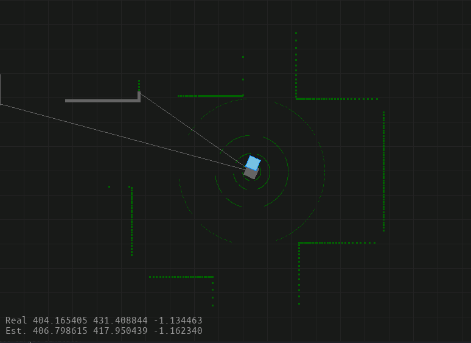

# 2D Localization

This is an interactive simulation to visualize 2D Simulation using SDL graphic library. I have also compiled this project into WebAssembly and put it up on GIthub, which is available here

This was developed mainly as a way for me to wrap my head around different techiniques in robotic localization, and what is more beginner-friendly that starting things off in 2D? 

  

## Features

In this simulation, a vehicle (square) is equipped with a camera and a raydar (ray-dar). Both are infused with random white noise as an attempt to replicate real-world sensor noise, and the task is to localize the cube. 

The basic movements are:

* `Left, Right button`: steer
* `Up button` to accelerate in the positive direction 
* `Down button` to accelerate in the negative direction 
* `Space` to brake
* `Enter` to randomly spawn obstacles of random sizes, can be drag around  

## Prerequisites

1. CMake
2. SDL2 Version at least 2.0.20
3. Emscripten (Optional)

## Installation 

        git clone https://github.com/hungdche/Localization-Simulation.git
        cd 
        mkdir build && cd build 
        cmake .. 
        make -j

